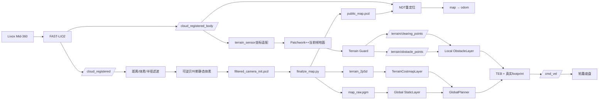
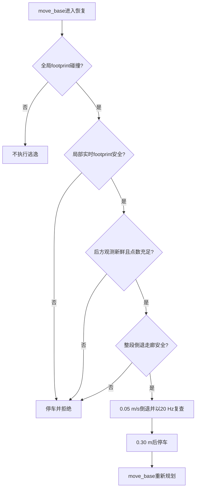

# 轮趣四轮差速机器人点云处理、地图构建与导航链路 V5.1 · BATF-Nav

> 技术名称：`BATF-NavBayesianAccumulationTerrainFusionNavigation`；简称 **BATF-Nav**；英文展开 **Bayesian Accumulation Terrain Fusion Navigation**。见[统一技术说明](../../docs/BATF-Nav_V5.1.md)。本次统一命名不改变V5.1版本、接口或车型参数。

> 平台：WheelTech 四轮差速底盘、Jetson NX、ROS Noetic、Livox Mid-360。
> 版本：V5.1，2026-09-08。依据当前仓库源码和122号车部署参数编写；不包含探索算法改动。

## 1. 文档目标与核心结论

本文同时回答两类问题：算法上每一步在估计什么、使用什么判据；工程上由哪个ROS包实现、参数在哪里、输入输出是什么。

正式链路有三条彼此隔离的数据支路：

1. 建图支路：FAST-LIO配准点云经过距离、体素、离群点和可逆贝叶斯静态判定，生成静态PCD；
2. 离线地图支路：静态PCD经过坐标变换、PMF种子、鲁棒平面、坡面连通、障碍重分类，生成NDT PCD、PGM和2.5D坡度图；
3. 导航实时支路：当前帧body点云经过坐标适配、Patchwork++和Terrain Guard，直接维护local costmap。

权威边界必须明确：

| 信息 | 唯一权威 | 不负责什么 |
|---|---|---|
| 长期静态/动态 | `wheeltec_pointcloud_mapper`贝叶斯体素 | 不判断坡度 |
| 全局固定障碍、未知区 | `map_raw.pgm`的StaticLayer | 2.5D层不得重复写静态障碍 |
| 全局坡度软代价 | `terrain_2p5d`的TerrainCostmapLayer | 不维护动态障碍 |
| 当前局部障碍 | Patchwork++ + Terrain Guard + local ObstacleLayer | 不查询保存高程，不写回PCD |
| 全局位姿修正 | NDT输出的`map -> odom` | 不参与当前帧地面分类 |

因此，导航时小幅重定位修正会改变机器人在全局地图中的位置，但不会把同一个局部点因为查询到另一格保存高程而反复改成地面或障碍。

## 2. 全链路数据流



## 3. 坐标系、点和变换

坐标约定为右手系，`x`向前、`y`向左、`z`向上。任一点从坐标系B变换到A：

```text
p_A = R_A_B p_B + t_A_B
T_A_B = [ R_A_B  t_A_B ]
        [   0        1   ]
```

连续变换满足：

```text
T_map_base = T_map_odom T_odom_base
T_map_odom = T_map_base (T_odom_base)^(-1)
```

工程对应：

| 坐标/话题 | 产生者 | 用途 |
|---|---|---|
| `camera_init`、`/cloud_registered` | FAST-LIO | 建图世界坐标点云 |
| `body`、`/cloud_registered_body` | FAST-LIO | NDT与当前帧局部感知 |
| `odom -> base_link`、`/fastlio_odom` | `wheeltec_pose_adapter` | 连续局部里程计 |
| `terrain_sensor` | `wheeltec_tf_manager` + `wheeltec_cloud_adapter` | 当前帧地面分割坐标 |
| `map -> odom` | `fast_lio_localization` | NDT全局修正 |

`wheeltec_system_bringup/config/wheeltec_geometry.yaml`是地图坐标外参唯一来源。当前`odom -> camera_init`为平移`[0.10, 0, 0.15] m`、Pitch `20 deg`。

## 4. 在线建图：从雷达到可逆静态PCD

### 4.1 FAST-LIO前端

包和入口：

| 项目 | 工程位置 |
|---|---|
| 启动入口 | `wheeltec_system_bringup/launch/wheeltec_mapping.launch` |
| FAST-LIO配置入口 | `wheeltec_system_bringup/launch/include/fastlio_mapping_wheeltec.launch.xml` |
| 上游节点 | `fast_lio/fastlio_mapping`，运行节点名`/laserMapping` |

FAST-LIO使用IMU传播和点到局部地图的误差更新估计位姿。对本文后级而言，关键结果是已经去畸变并配准的`/cloud_registered`以及车体系`/cloud_registered_body`。正式建图关闭FAST-LIO原生PCD保存，避免产生第二份未经静态判定的地图。

当前入口参数：`point_filter_num=3`、`max_iteration=3`、`filter_size_surf=0.5 m`、`filter_size_map=0.5 m`。这些参数属于FAST-LIO状态估计和局部地图，不等同于后级静态地图的`0.05 m`精细体素。

### 4.2 单帧预处理

实现包：`wheeltec_pointcloud_mapper`。

源码：`wheeltec_pointcloud_mapper/src/pointcloud_mapper_node.cpp`。

参数：`wheeltec_pointcloud_mapper/config/mapper.yaml`。

输入点`p_w`先用FAST-LIO位姿变回body计算量程：

```text
p_b = R_w_b^T (p_w - t_w_b)
r = ||p_b||_2
保留条件：0.50 m <= r <= 50.0 m
```

随后执行：

1. 删除NaN/Inf；
2. 可选车体包围盒删除，当前`self_filter/enable=false`；
3. `0.05 m` VoxelGrid，同一小体素以点的质心代表，降低重复点；
4. RadiusOutlierRemoval：半径`0.20 m`内至少有2个邻点，否则删除。

目的分别是限制有效测距、降低计算量、压制孤立反射。半径滤波只处理空间孤立点，不能替代动态目标判定。

### 4.3 三维贝叶斯占据更新

动态/静态状态体素边长为`v_s=0.20 m`，体素索引为：

```text
k(p) = ( floor(x/v_s), floor(y/v_s), floor(z/v_s) )
```

对体素占据概率`P_t`使用log-odds：

```text
L_t = log(P_t / (1-P_t))
命中：L_t = clamp(L_(t-1) + log(p_hit/(1-p_hit)), -4, 4)
穿透：L_t = clamp(L_(t-1) + log(p_miss/(1-p_miss)), -4, 4)
P_t = 1 / (1 + exp(-L_t))
```

当前数值：

| 参数 | 值 | 对应log-odds |
|---|---:|---:|
| `hit_probability` | 0.65 | `+0.619` |
| `miss_probability` | 0.30 | `-0.847` |
| `occupied_probability` | 0.75 | 晋升阈值`+1.099` |
| `clearing_probability` | 0.35 | 清除阈值`-0.619` |

同一帧同一体素最多计一次hit或miss，防止点密度而非时间持续性主导概率。

### 4.4 静态晋升不是单一概率阈值

候选体素成为静态体素必须同时满足：

```text
hit_scans >= 12
L_t >= logit(0.75)
hit_scans / (hit_scans + miss_scans) >= 0.60
last_hit_time - first_hit_time >= 2.0 s
```

目的：走动的人可能瞬间产生很多点，但通常无法在同一`0.20 m`三维体素持续2秒并保持60%命中率；墙、坡面和固定低矮障碍可以积累到晋升条件。

### 4.5 自由射线和可逆清除

对每隔`ray_stride=2`个滤波点取一条传感器射线。清除终点为：

```text
d_clear = min(20.0 m, ||p_endpoint-p_sensor|| - 0.20 m)
```

代码用三维Amanatides-Woo式DDA逐体素穿越。对方向分量`d_x`：

```text
tDelta_x = v_s / |d_x|
tMax_x = 到下一个x体素边界的射线参数
每次选择min(tMax_x,tMax_y,tMax_z)并跨入对应体素
```

端点前保留`0.20 m`余量，避免把真实障碍端点当自由空间。若穿过的体素同时被本帧端点命中，则hit优先，不执行miss。

已晋升静态体素只有同时满足下式才降级：

```text
L_t <= logit(0.35)
consecutive_miss_scans >= 8
连续miss持续时间 >= 0.75 s
```

这就是“人离开后地图可被清除”的机制。它不是永久覆盖，也不是只增不减的地形累积器。

### 4.6 粗状态体素与精细几何体素

概率状态使用`0.20 m`体素，输出几何使用`0.05 m`体素。每个精细体素记录坐标和强度均值，但关联一个粗体素`generation`：

```text
fine_point有效 <=> 对应coarse voxel仍存在
                 且generation一致
                 且coarse voxel confirmed_static=true
```

粗体素被清除后，其整代精细几何同时失效，防止旧人物点在以后同位置重新命中时复活。

### 4.7 建图输出

| 输出 | 频率/时机 | 含义 |
|---|---|---|
| `/wheeltec/static_scan` | 每帧 | 本帧中已晋升静态的点 |
| `/wheeltec/dynamic_points` | 每帧，调试开关 | 尚未晋升的候选点，不等同于语义人物 |
| `/wheeltec/static_map_cloud` | 2 s一次 | 当前全部有效静态点 |
| `filtered_camera_init.pcd` | 30 s自动保存及正常退出 | 交付静态PCD源 |
| `traversed_path_map.pcd` | 位移每增加0.05 m记录 | `base_link`中心轨迹，自由证据 |

## 5. 离线地图收尾：从静态PCD到PGM和2.5D

统一入口：

```bash
rosrun wheeltec_map_tools finalize_map.py <map_name>
```

编排脚本位于`wheeltec_map_tools/scripts/finalize_map.py`。它拒绝混用两次建图的`filtered_camera_init.pcd`和已归档`raw_camera_init.pcd`。

### 5.1 坐标转换与NDT地图

`wheeltec_map_tools/pcd_transform_node`依据`wheeltec_geometry.yaml`将静态PCD从`camera_init`变换到`map`，得到`public_map.pcd`。该PCD是NDT唯一目标地图，也是后续地形重建的唯一静态点来源。

### 5.2 PMF只提供保守种子

实现：`wheeltec_map_tools/src/terrain_reclassify.cpp`，节点`terrain_reclassify_node`。

PMF对二维栅格最低表面做逐级形态学开运算。窗口由`base=2`指数增长到`max_window_size=101`。某级允许高差可概括为：

```text
tau_k = min(max_distance,
            initial_distance + slope * (w_k-w_(k-1)) * cell_size)
```

当前`cell_size=0.05 m`、`slope=0.40`、`initial_distance=0.04 m`、`max_distance=0.18 m`。PMF结果只作为分布式可信锚点，不直接作为最终地面，因此长坡可由后续局部平面生长恢复。

### 5.3 每格低表面候选

对每个`0.05 m` XY格的高度集合`Z_c`取5%分位数：

```text
z_candidate(c) = Q_0.05(Z_c)
```

低分位数降低墙面、顶棚和稀疏高点成为地面的概率。

### 5.4 鲁棒局部平面验证

在半径`0.30 m`内拟合：

```text
z_i = a dx_i + b dy_i + c + e_i
beta = [a,b,c]^T
beta* = argmin Σ w_i (x_i^T beta - z_i)^2
基础权重 w_distance = 1 / (0.05 + sqrt(dx_i^2+dy_i^2))
```

使用4轮IRLS，残差权重为：

```text
w_robust = 1                         , |e_i| <= 0.05 m
           0.05 / |e_i|             , |e_i| > 0.05 m
w_i = w_distance * w_robust
```

平面必须同时满足：至少8个候选、内点率不低于0.55、二维最小扩展不低于`0.04 m`、RMSE不高于`0.035 m`、中心候选距平面不高于`0.05 m`，以及：

```text
theta = atan(sqrt(a^2+b^2)) <= 25 deg
```

二维扩展约束防止一条窄墙边缘仅靠共线点被误拟合成地面。

### 5.5 坡面连通生长

候选格之间在`0.25 m`内才允许连接。当前格`i`与邻格`j`必须满足：

```text
|z_j-z_i| <= 0.015 + tan(25 deg) * d_ij
|z_j - plane_i(x_j,y_j)| <= 0.05 m
|z_i - plane_j(x_i,y_i)| <= 0.05 m
acos(n_i dot n_j) <= 20 deg
```

生长起点包括原点附近可信地面和所有通过验证的PMF分布式锚点。最终连通地面至少100格，否则转换直接失败，避免输出一张看似成功但地面链路已经崩溃的地图。

### 5.6 稠密地面、有限补洞与连通域

在已连通候选上以`0.80 m`半径再次拟合局部平面。只有满足下列之一的格才生成地面高度：

- `0.15 m`内确有原始XY观测；
- 该格是内部采样洞，`0.30 m`内在近似相对方向存在已连通支撑。

单侧边缘、悬崖外侧和房间外部不会因平面外推变成自由区。生成表面后做8邻域连通域过滤，保留规模至少`max(100, 最大连通域的3%)`的部分。

### 5.7 障碍物重新分类

对静态PCD中的每个点，使用同XY格地面`z_g`计算相对高度：

```text
h_rel = z_point - z_g
障碍条件：0.04 m <= h_rel <= 1.50 m
```

低于4 cm的起伏并入地面；高于1.50 m的顶棚和高反射不进入导航障碍；没有可靠地面参考的点不强行投影为障碍。输出为`terrain_ground_map.pcd`和`terrain_obstacles_map.pcd`。

### 5.8 PGM生成及证据优先级

实现：`wheeltec_map_tools/src/pcd_to_pgm.cpp`，节点`pcd_to_pgm_node`。

地图分辨率`0.05 m`。地面栅格先膨胀`0.10 m`形成观测自由区；轨迹中心线以`0.20 m`半径形成实车扫掠自由证据；障碍不在PGM文件内预膨胀：

```text
F = dilate(observed_ground, 0.10 m)
    union dilate(traversed_base_path, 0.20 m)
O = classified_obstacle_cells

PGM(c) = 0黑色       , c in O
         254白色     , c in F and c not in O
         205灰色     , otherwise
```

注意代码写入顺序保证障碍覆盖自由证据，轨迹不能在墙上开洞。`map_raw.pgm`和`map.pgm`均不烘焙障碍膨胀，运行时由costmap的InflationLayer处理，避免门口双重膨胀。

### 5.9 2.5D高程与坡度代价

实现包：`wheeltec_2p5d_navigation`。

节点：`terrain_map_builder_node`。

源码：`wheeltec_2p5d_navigation/src/terrain_map_builder_node.cpp`。

参数：`wheeltec_2p5d_navigation/config/terrain_builder.yaml`。

在`0.10 m`格内取地面高度20%分位数，小洞最多做4轮8邻域中值填充，每格至少3个邻居。随后在`0.30 m`半径内，仅使用与中心高差不超过`0.12 m`的高度拟合平面：

```text
beta* = argmin ||A beta - z||_2^2
theta = atan(sqrt(a^2+b^2)) * 180/pi
roughness = sqrt(||A beta-z||_2^2 / N)
step = max_neighbor |z_neighbor - plane(x_neighbor,y_neighbor)|
```

坡度代价为二次函数：

```text
s = clamp((theta-5 deg)/(25 deg-5 deg), 0, 1)
C_slope = round(80 * s^2)             , theta <= 25 deg
C_slope = 254                         , theta > 25 deg
```

孤立致命坡度格若3x3邻域致命格少于4个，则降为80，抑制稀疏点或位姿噪声造成的单格尖峰。`fuse_static_obstacles=false`，因此2.5D层只给坡度代价，不再次融合静态障碍。

保存六层数据：`elevation`、`slope_deg`、`roughness`、`step_height`、`cost`和`confidence`，入口文件为`terrain_2p5d.yaml`。

### 5.10 地图产物清单

| 文件 | 使用者 | 含义 |
|---|---|---|
| `raw_camera_init.pcd` | 归档/一致性检查 | 当次贝叶斯静态PCD原始归档 |
| `public_map.pcd` | `fast_lio_localization/map_loader` | NDT目标地图 |
| `terrain_ground_map.pcd` | PGM、2.5D生成器 | 连续地面表面 |
| `terrain_obstacles_map.pcd` | PGM生成器 | 相对地面4 cm到1.5 m静态障碍 |
| `map_raw.pgm/.yaml` | navigation的StaticLayer | 全局占据与未知区 |
| `terrain_2p5d.yaml`及二进制层 | TerrainCostmapLayer | 保存坡度软代价 |
| `map_metadata.yaml` | 回归审计 | 外参、有效参数和证据来源快照 |

## 6. NDT重定位：PCD匹配和矩阵更新

实现包：`fast_lio_localization`。

源码：`fast_lio_localization/src/fast_lio_localization.cpp`。

日常启动：`roslaunch wheeltec_system_bringup wheeltec_localization.launch`；其内部 NDT 子模块为 `wheeltec_system_bringup/launch/include/wheeltec_relocalization.launch.xml`。

### 6.1 输入预处理

目标是`public_map.pcd`；源点云是`/cloud_registered_base`。源点云先做`0.20 m` VoxelGrid，再保留水平量程`0.50～50.0 m`。

### 6.2 NDT概率模型

NDT把目标地图每个分辨率单元内的点表示成高斯分布：

```text
mu_k = (1/N_k) Σ p_j
Sigma_k = (1/(N_k-1)) Σ (p_j-mu_k)(p_j-mu_k)^T
```

给定源点`q_i`和候选位姿`T(xi)`，目标是最大化其落入对应高斯的似然，等价于最小化：

```text
xi* = argmin Σ_i 0.5 * (T(xi)q_i-mu_k)^T Sigma_k^(-1)
                         (T(xi)q_i-mu_k)
```

当前NDT参数：分辨率`1.0 m`、最多30次迭代、变换收敛量`0.01`、线搜索步长`0.10`、4线程。

### 6.3 何时重新匹配

系统同步当前点云与`/fastlio_odom`。相对上次NDT触发位置满足任一条件即重新匹配：

```text
平移增量 > 0.50 m
偏航增量 > 0.174533 rad = 10 deg
```

收到`/initialpose`也会立即以给定姿态为初值执行一次NDT。

### 6.4 map到odom的计算

NDT输出`T_map_base^NDT`后：

```text
T_map_odom = T_map_base^NDT (T_odom_base^FAST-LIO)^(-1)
```

该矩阵持续发布，并向未来预发布`0.25 s`，避免TEB查询TF时出现短时未来外推错误。

### 6.5 当前实现必须明确的接受行为

当前源码调用`ndt.align()`后直接读取`getFinalTransformation()`并更新`map -> odom`，没有检查`hasConverged()`、fitness score、迭代次数上限状态或矩阵跳变量。因此“触发了NDT”不等于“已经被质量门限确认收敛”。这是定位链路本身的工程事实，也是分析导航中矩阵突然变化时首先要检查的位置。

建议监测至少包括：NDT耗时、变换增量、点数、`hasConverged`和fitness；但本V5.1提交没有额外改变定位接受策略。

## 7. 导航实时点云：当前帧地面与障碍

该支路由`wheeltec_navigation/launch/navigation_teb.launch`启动，不读取`terrain_2p5d`地面高度，也不写回静态PCD。

### 7.1 坐标适配

包：`wheeltec_cloud_adapter`。

节点：`wheeltec_terrain_cloud_adapter`。

输入输出：`/cloud_registered_body -> /cloud_registered_terrain`。

代码使用点云时间戳查询TF并执行刚体变换，超时`0.1 s`；找不到TF则丢弃该帧，不使用过期变换。

### 7.2 Patchwork++当前帧分割

上游包：`patchworkpp`，可执行程序`demo`。

节点名：`wheeltec_navigation_patchworkpp`。

配置：`wheeltec_terrain_filter/config/patchworkpp_wheeltech.yaml`。

Patchwork++先按距离、环和扇区构成Concentric Zone Model。每个局部区域从最低点代表集LPR初始化地面种子，对种子协方差做特征分解，最小特征值对应法向量`n`：

```text
mu = (1/N) Σ p_i
C = (1/N) Σ (p_i-mu)(p_i-mu)^T
n = eigenvector_min(C)
d(p) = |n^T(p-mu)|
```

若点到平面距离小于区域阈值且法向足够朝上，则进入下一轮地面种子；当前迭代3次。工程主参数：

| 参数 | 值 | 作用 |
|---|---:|---|
| `sensor_height` | 0.30 m | 雷达离地高度基准 |
| `min_r/max_r` | 0.25/12.0 m | Patchwork++处理量程 |
| `num_iter` | 3 | 地面平面迭代次数 |
| `num_lpr` | 20 | 最低点代表数量 |
| `num_min_pts` | 8 | 局部分区最低点数 |
| `th_seeds/th_dist` | 0.12/0.08 m | 种子和地面距离阈值 |
| `uprightness_thr` | 0.85 | 法向竖直性阈值 |
| `enable_RNR/RVPF/TGR` | true | 反射噪声、垂直平面和临时地面抑制 |

输出`/terrain/patchwork_ground`和`/terrain/patchwork_nonground`具有相同时间戳，Terrain Guard使用ExactTime同步。

### 7.3 Terrain Guard地面网格

包：`wheeltec_terrain_filter`。

源码：`wheeltec_terrain_filter/src/terrain_guard_node.cpp`。

配置：`wheeltec_terrain_filter/config/terrain_guard_wheeltech.yaml`。

局部网格分辨率`0.15 m`、范围`x=[-5,5] m`、`y=[-4,4] m`，仅处理水平距离`0.25～5.0 m`的点。每格对Patchwork++ ground点计算：

```text
z_ground = 0.5 * (Q_0.20(Z) + Q_0.50(Z))
vertical_span = Q_0.80(Z) - Q_0.20(Z)
```

半径2格邻域拟合平面`z=ax+by+c`：

```text
beta* = argmin ||A beta-z||_2^2
slope = atan(sqrt(a^2+b^2))
RMSE = sqrt(||A beta-z||_2^2/N)
```

某地面格为安全格必须同时满足：

```text
step_neighbor_count < 2
slope <= 22 deg
vertical_span <= 0.12 m
且不是(RMSE > 0.05 m 且 vertical_span > 0.06 m)
```

相邻点被计为台阶证据需同时满足`|dz|>0.08 m`以及`atan2(|dz|, horizontal_distance)>22 deg`。

### 7.4 障碍分类逻辑

Patchwork++ ground点：安全格进入`safe_ground`；不安全格被抬到`marking_z=0.20 m`并进入障碍点云。

Patchwork++ nonground点优先在周围3格内寻找最近安全地面`z_g`：

```text
h_rel = z_point-z_g
有安全地面时：0.06 m <= h_rel <= 1.50 m -> obstacle
无安全地面时：0.03 m <= z_point <= 1.50 m -> conservative obstacle
其余 -> unknown debug cloud
```

无地面参考时采用绝对高度保守判障碍，能防止漏掉近场实体，但也是稀疏地面或外参错误时产生漂移硬障碍的主要风险点。

### 7.5 输出与local costmap

| 话题 | local costmap动作 | 含义 |
|---|---|---|
| `/terrain/obstacle_points` | marking | 安全格外地面和合格nonground障碍 |
| `/terrain/clearing_points` | clearing raytrace | 范围内全部ground+nonground射线端点 |
| `/terrain/ground_points` | 不进入costmap | 安全地面调试 |
| `/terrain/unsafe_ground_points` | 不直接进入costmap | 坡度/台阶/粗糙地面调试 |
| `/terrain/unknown_points` | 不进入costmap | 未满足障碍判据的nonground调试 |
| `/terrain/status` | diagnostics | 点数、格数和处理时延 |

`wheeltec_navigation/config/local_costmap_slope.yaml`配置为`6 m x 6 m`、`0.05 m/格`、更新10 Hz、发布4 Hz、障碍范围4 m、raytrace范围5 m、`observation_persistence=0 s`。因此旧点不跨帧保持；清除依赖当前传感器真实射线，雷达没有观察到的后方不能推断为自由。

122号车已测运行频率约10 Hz，端到端约29 ms；这个数值是现场基线，不是代码硬实时保证。

## 8. 全局/局部代价图和规划器

### 8.1 全局costmap融合

配置：`wheeltec_navigation/config/global_costmap_slope.yaml`。

插件顺序：StaticLayer、TerrainCostmapLayer、InflationLayer。TerrainCostmapLayer仅在PGM已经是已知格时执行最大值融合：

```text
C_global(c) = max(C_static(c), C_slope(c)), static cell known
未知格所有权仍属于StaticLayer
```

`unknown_as_lethal=false`不会把2.5D未知单独写成致命障碍，但GlobalPlanner的`allow_unknown=false`仍禁止路径进入PGM未知区。

### 8.2 InflationLayer

ROS costmap对距障碍距离`d`的典型指数代价为：

```text
C(d) = lethal/inscribed cost                  , 车体内切范围内
       (INSCRIBED-1) * exp(-k(d-r_inscribed)) , 外部膨胀范围
       0                                      , 超出inflation_radius
```

当前`cost_scaling_factor k=3.0`。全局`inflation_radius=0.15 m`用于保持窄门拓扑连通；局部`inflation_radius=0.22 m`保留更保守的实时缓冲。PGM自身`obstacle_inflation_m=0`，因此没有离线和在线双重膨胀。

### 8.3 车体模型与60 cm门

`wheeltec_navigation/config/costmap_common.yaml`和TEB均使用真实矩形：长`0.50 m`、宽`0.40 m`，`footprint_padding=0`。理论正对60 cm门时横向几何余量为：

```text
每侧余量 = (0.60-0.40)/2 = 0.10 m
```

TEB额外要求`min_obstacle_dist=0.04 m`，因此理想正对时仍有约6 cm/侧的姿态和建图误差预算。该计算不包含门框点云噪声和滑移转向甩尾，所以必须低速、尽量正对。

### 8.4 GlobalPlanner与TEB

全局规划器为`global_planner/GlobalPlanner`，使用Dijkstra，`allow_unknown=false`，目标容差`0.15 m`。它在全局代价图上寻找累计代价最小路径。

局部规划器为TEB，可抽象为带时间参数轨迹的加权优化：

```text
trajectory* = argmin Σ_k w_k J_k
J包含时间、速度、加速度、非完整约束、障碍距离和运动方向约束
```

关键工程参数：`max_vel_x=0.20 m/s`、`max_vel_x_backwards=0.15 m/s`、`max_vel_theta=0.40 rad/s`、真实polygon footprint、`min_obstacle_dist=0.04 m`、`inflation_dist=0.15 m`。homotopy当前关闭，TEB只优化单一拓扑附近轨迹。

## 9. 起点位于全局障碍时的安全逃逸

实现：`wheeltec_2p5d_navigation/src/start_escape_recovery.cpp`。

插件：`wheeltec_2p5d_navigation/StartEscapeRecovery`。

配置：`wheeltec_navigation/config/move_base_slope_teb.yaml`。



预检以`0.025 m`步长采样整段`0.30 m`倒退走廊，每个采样位姿用真实footprint查询local costmap。倒退进度是沿初始车尾方向的投影：

```text
progress = -((x_t-x_0)cos(yaw_0) + (y_t-y_0)sin(yaw_0))
```

后方覆盖安全门：

```text
N_rear = count(-0.70 <= x <= -0.15, |y| <= 0.35)
允许倒车 <=> N_rear >= 20 且 cloud_age <= 0.25 s
```

实测当前Mid-360受车体遮挡，该后方近场`N_rear=0`。所以现配置会拒绝自动倒车；“0点”表示未观测，不表示安全。真正启用自动倒退必须加入后置深度、ToF、超声波或后向雷达，并把覆盖状态接入该安全门。

## 10. ROS包、节点和配置索引

| 阶段 | ROS包/节点 | 关键源码或入口 |
|---|---|---|
| 建图编排 | `wheeltec_system_bringup` | `launch/wheeltec_mapping.launch` |
| 位姿/注册点云 | `fast_lio/laserMapping` | `launch/include/fastlio_mapping_wheeltec.launch.xml` |
| 静态判定 | `wheeltec_pointcloud_mapper` | `src/pointcloud_mapper_node.cpp`、`config/mapper.yaml` |
| 地图收尾 | `wheeltec_map_tools` | `scripts/finalize_map.py` |
| 地面重建 | `wheeltec_map_tools/terrain_reclassify_node` | `src/terrain_reclassify.cpp`、`config/terrain_reclassify.yaml` |
| PGM生成 | `wheeltec_map_tools/pcd_to_pgm_node` | `src/pcd_to_pgm.cpp`、`config/wheeltec_*.yaml` |
| 2.5D构建 | `wheeltec_2p5d_navigation/terrain_map_builder_node` | `src/terrain_map_builder_node.cpp`、`config/terrain_builder.yaml` |
| NDT定位 | `fast_lio_localization/wheeltec_global_localizer` | `src/fast_lio_localization.cpp`、`launch/include/wheeltec_relocalization.launch.xml` |
| 实时坐标适配 | `wheeltec_cloud_adapter/wheeltec_terrain_cloud_adapter` | `src/cloud_frame_adapter.cpp` |
| 当前帧地面 | `patchworkpp/wheeltec_navigation_patchworkpp` | `config/patchworkpp_wheeltech.yaml` |
| 地形安全判定 | `wheeltec_terrain_filter/wheeltec_navigation_terrain_guard` | `src/terrain_guard_node.cpp`、`config/terrain_guard_wheeltech.yaml` |
| 全局坡度层 | `wheeltec_2p5d_navigation/TerrainCostmapLayer` | `src/terrain_costmap_layer.cpp` |
| 规划与控制 | `wheeltec_navigation/move_base` | `launch/navigation_teb.launch`及`config/*.yaml` |
| 起点逃逸 | `wheeltec_2p5d_navigation/StartEscapeRecovery` | `src/start_escape_recovery.cpp` |

## 11. 启动、监测和验收

### 11.1 建图与转换

```bash
roslaunch wheeltec_system_bringup wheeltec_mapping.launch map_name:=factory_a
# 建图结束后在该终端Ctrl+C，等待PCD保存完成
rosrun wheeltec_map_tools finalize_map.py factory_a
```

转换日志必须看到PMF种子、候选、有效平面、连通地面、最终surface、障碍点数以及各PGM输出。若`Connected terrain is too small`，应视为失败，不应继续导航。

### 11.2 定位与导航

```bash
# 终端1，持续运行
roslaunch wheeltec_system_bringup wheeltec_localization.launch map_name:=factory_a

# 定位稳定后，终端2
roslaunch wheeltec_navigation navigation_teb.launch map_name:=factory_a
```

导航launch只增加地图、实时地面分割、costmap、规划器和恢复插件，不重启Livox、FAST-LIO、NDT或底盘。

### 11.3 在线监测命令

```bash
rosnode list | grep -E 'global_localizer|navigation_patchworkpp|navigation_terrain_guard|move_base'
rostopic hz /cloud_registered_terrain
rostopic hz /terrain/obstacle_points
rostopic hz /terrain/clearing_points
rostopic echo -n 1 /terrain/status
rosparam get /move_base/TebLocalPlannerROS/min_obstacle_dist
rosparam get /move_base/start_escape_recovery/require_rear_observation
```

RViz需同时对照：`/nav_static_map`、`/move_base/global_costmap/costmap`、`/move_base/local_costmap/costmap`、`/terrain/ground_points`、`/terrain/obstacle_points`、全局路径和局部路径。

### 11.4 验收指标

| 测试 | 通过条件 | 主要定位层级 |
|---|---|---|
| 静止人员离开建图区 | 最终PCD不保留完整人物轮廓 | 贝叶斯hit/miss、射线覆盖 |
| 固定低矮障碍 | PGM和obstacle PCD连续存在 | 地面重建、4 cm相对高度阈值 |
| 上坡/下坡 | 坡面连续，非整片致命障碍 | PMF锚点、平面生长、25 deg阈值 |
| 室内边缘 | 未观测外侧保持unknown，不大面积误清空 | surface观察半径、轨迹证据 |
| 门口静止 | local障碍不跨帧拖影 | `observation_persistence=0`、当前帧分割 |
| 60 cm门 | 正对低速通过且polygon不碰撞 | footprint、TEB 4 cm、局部点云稳定性 |
| 起点被旧静态图覆盖 | 无后方覆盖时拒绝倒退 | rear observation gate |
| 后方放实体障碍 | 接后置传感器后逃逸必须拒绝 | 后方点数、走廊footprint检查 |

## 12. 参数修改的因果关系

| 现象 | 优先参数/代码 | 影响与风险 |
|---|---|---|
| 人物仍进入最终PCD | `min_hit_scans`、`min_observation_span`、`min_hit_ratio` | 调高更能滤动态，但稀疏固定障碍也更难晋升 |
| 人离开后仍不清除 | `ray_stride`、`min_clear_miss_scans/span`、遮挡 | 减小stride增加清除射线，也增加NX计算量 |
| 固定障碍丢失 | 半径滤波邻点数、贝叶斯晋升条件 | 不应直接关闭贝叶斯，否则人物重新进入地图 |
| 坡面断裂 | 平面RMSE、连接容差、surface观察半径 | 放宽过多会把墙边或跨层结构连成地面 |
| local坡面成墙 | `sensor_height`、Patchwork阈值、Guard坡度/step | 先校外参和ground输出，不先缩障碍高度阈值 |
| 门口障碍闪烁 | Patchwork ground比例、无参考保守分支、TF时延 | 不应通过增加persistence掩盖，会形成更长拖影 |
| 全局门被封死 | PGM障碍、全局inflation、重复障碍层 | 当前PGM不预膨胀，2.5D不重复静态障碍 |
| 后轮擦门 | TEB净空、进入姿态、车体尺寸标定 | 不缩小真实footprint；当前额外净空4 cm |
| NDT矩阵突跳 | 初值、源点数、fitness和收敛门 | 当前代码无质量接受门，需从定位节点修正 |

## 13. 已知边界

- 贝叶斯过滤按空间时间持续性工作，不做人物、车辆等语义识别；长时间静止的人仍可能晋升。
- 人或物体只有在后续射线真正穿过原体素时才会产生miss；持续遮挡区域不会凭时间自动清除。
- 离线地面重建依赖保存静态PCD的空间覆盖，未观测区不能靠算法可靠补全。
- Patchwork++和Terrain Guard均为当前帧算法，极稀疏点云、反射、外参错误会造成标签波动。
- local costmap只认识传感器看到的区域；当前车后近场没有覆盖，自动倒退保持禁用是正确安全行为。
- 60 cm门对40 cm车体每侧只有10 cm物理余量，滑移转向和后轮轨迹使实车余量小于静态几何值。
- 当前NDT实现没有收敛/fitness接受门；本文如实记录，未在V5.1中擅自改变定位策略。
